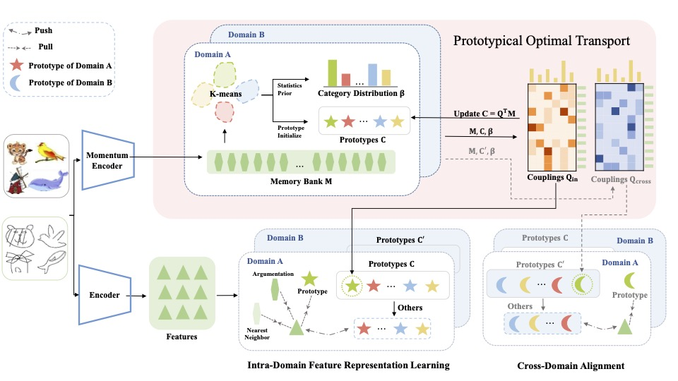

Unsupervised Cross-Domain Image Retrieval via Prototypical Optimal Transport
=============================================================================

Code release for Unsupervised Cross-Domain Image Retrieval via Prototypical Optimal Transport [accepted by AAAI 2024]
<p align="center">
  
</p>

## Requirements
- Python 3.8.8
- Pytorch 1.8.0
- numpy 1.23.5
- scikit-learn 1.2.2
- faiss-gpu 1.7.2

## Datasets
* [Office-Home Dataset](https://www.hemanthdv.org/officeHomeDataset.html)
* [DomainNet Dataset](http://ai.bu.edu/M3SDA/)
## Pre-trained model
* [MoCo v2 model](https://github.com/facebookresearch/moco): Download the MoCo v2 model trained after 800 epochs.

## Run code
For DomainNet:
```
CUDA_VISIBLE_DEVICES=0 ./Scripts/DomainNet.sh
```

For Office-Home:
```
CUDA_VISIBLE_DEVICES=0 ./Scripts/Office-Home.sh
```
## Model checkpoints


## Acknowledgement
This repository is built based on the source code for [Feature Representation Learning for Unsupervised Cross-domain Image Retrieval](https://github.com/conghui1002/UCDIR)

## Cite our work
If you find this repository useful in your research, please consider citing:

```

```
